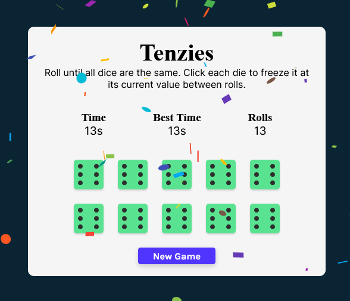

# 

[Tenzies](https://kingmathers92.github.io/React-Tenzies-Game/)

### A dice game where you hold one or more dices with the smae value and keep rolling untill you get 10 matches.

## Motivation:

I created this project using React while applying what I learned about React Hooks.

## To Do🔧:

- [x] Add dots to the dice instead of number
- [ ] Add sound effect when you win the game
- [ ] Dice blinks when you win
- [x] Track number of rolls
- [x] Track time it took to win
- [x] Save best time & score to localstorage

## Preview:

